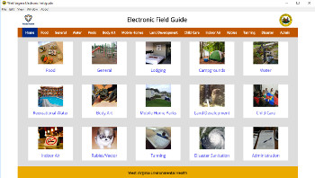
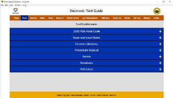
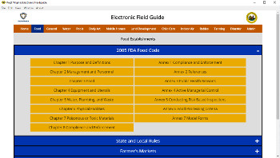
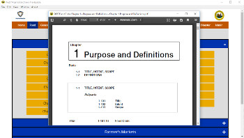

# West Virginia Electronic Field Guide

## Version 6.0.2.1

The West Virginia Electronic Field Guide is a Windows desktop application that provides Environmental Health field inspectors with an easy to use user interface to access commonly used rules, forms, handouts, and reference material.  

This application was made with [NodeJS](https://nodejs.org/en/) and [Electron](http://electron.atom.io).

## Screenshots

 
 
 
  

## License

Copyright 2017 [Daniel McNeil - Smellydog Coding](mailto:smellydogcoding@gmail.com) - [www.smellydogcoding.com](www.smellydogcoding.com)  

This software is a Free and Open Source (FOSS) project under the terms of the MIT Lisence.

By using this software you agree to the following:

1. This software, including all supplied documents, images and spreadsheets, is provided "as is", without warranty of any kind, express or implied, including but not limited to the warranties of merchantability, fitness for a particular purpose and noninfringement. In no event shall the authors or copyright holders be liable for any claim, damages or other liability, whether in an action of contract, tort or otherwise, arising from, out of or in connection with the software or the use or other dealings in the software.

2. This software contains documents from the following external sources:  
   a. Food and Drug Administration  
   b. Centers for Disease Control and Prevention  
   c. West Virgina Department of Health and Human Resources  
   d. West Virginia Department of Agriculture  
   e. chinesefoodsafety.com  
   f. Nevada Food Safety Task Force  
   g. North Carolina Department of Agriculture  
   h. National Environmental Health Association  
   i. Michigan Bed Bug Working Group  
   j. Portable Sanitation Association International  
   k. US Department of Justice  
   l. Consumer Product Safety Commission  
   m. National Small Flows Clearinghouse  
   n. Environmental Protection Agency  
   o. North Carolina Department of Health and Human Services  
   p. West Virginia Department of Environmental Protection  
   q. Occupational Safety and Health Administration  
   r. Indiana State Department of Health  
   s. American Society for Microbiology  
   t. Council to Improve Foodborne Outbreak Response  
   u. Association of Food and Drug Officials  

3. Any distribution of documents included in this software shall be in accordance with the established policies of these organizations.  In no event shall the authors or copyright holders be liable for any claim, damages or other liability, whether in an action of contract, tort or otherwise, arising from, out of or in connection with the distribution of documents included in this software.  

4. All reference material in this software is for general knowledge purposes only.  All users shall be responsible for following or enforcing all applicable laws and rules in their respective jurisdictions.

## Contribute to this project

### Prerequisites

**NSIS**  
NSIS must be installed and the path to *makensis* must be added to your *path* to use the `npm run installer` and `npm run build commands`

### Download
Clone the repository and run `npm install`.  
Run `npm start` to launch the application.  
`npm run package` will package the application into a windows executible application.  
`npm run installer` will create installers for the application.  
`npm run build` will run `npm run package` and `npm run installer` serially.

### bugs and feature reqests
For all bugs, including incorrect, mistranslated, or out of date documents, as well as to request new features, please use **this repo's issue tab** to create a new issue.